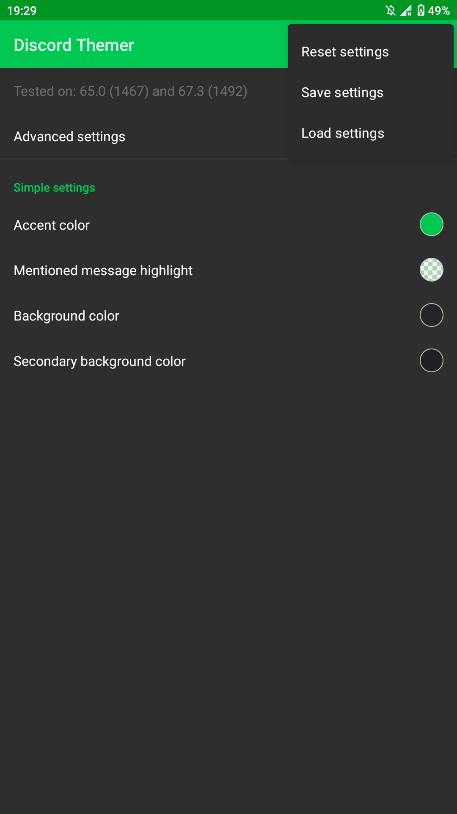
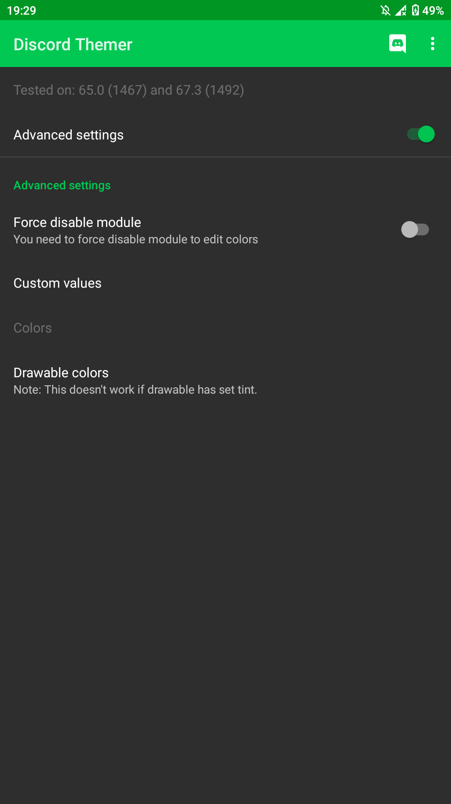
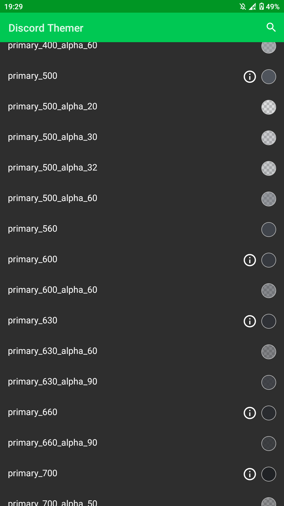

# DiscordThemer
Xposed module that allows you to change colors in Discord. Requires enabled Resource Hooks in EdXposed / LSPosed Manager settings.

**Note**: This app doesn't support Android below version 6.0, on lower versions may crash or just not work.

If you don't use [LSPosed](https://github.com/LSPosed/LSPosed) you may need to reboot to see all your changes.

[Support Server](https://discord.gg/EsNDvBaHVU)

### TODO
- [x] Rewrite module to kotlin and ui to jetpack compose
- [ ] Use material you
- [ ] Updater
- [ ] More fixes for latest versions
- [ ] Implement descriptions for colors in advanced mode editor
- [ ] Customize more things than colors
- [ ] Implement new theme format
- [ ] Update screenshots

### Screenshots
</img>
</img>
</img>
